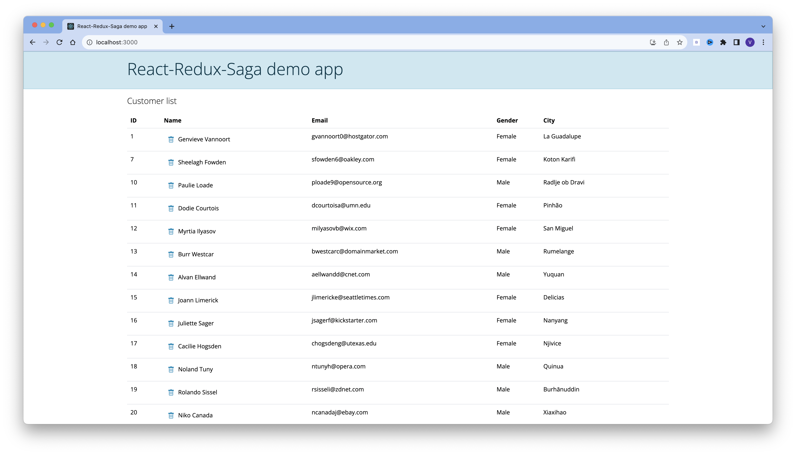

# React/Redux/Saga demo app

To run this example, run the following commands from terminal:

- `git clone https://github.com/vinod-kayartaya/react-redux-saga-demo-app.git`
- `cd react-redux-saga-demo-app`
- `npm install`
- `npm run rest-server`
- `npm start` (in a new terminal)

Visit `http://localhost:3000/` to view the app

